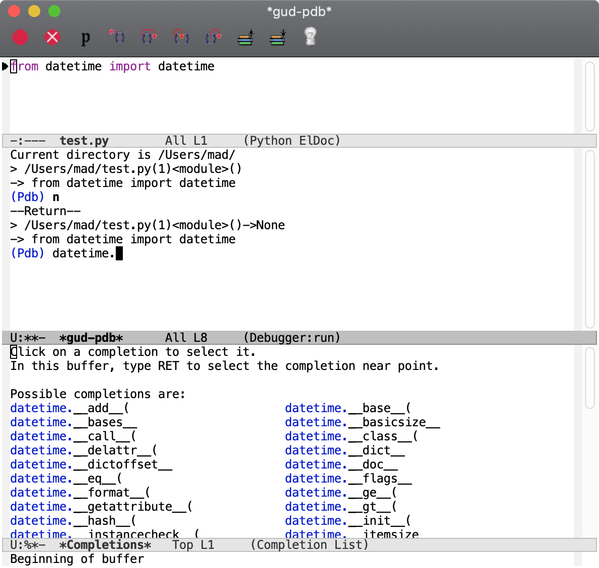

# emacs-pdb-capf
`completion-at-point` function for `pdb` (Python debugger)

## Usage

Add `pdb-capf` to `completion-at-point-functions`, e.g.:

```elisp
(add-hook 'completion-at-point-functions 'pdb-capf nil t)
```

## Screenshot


